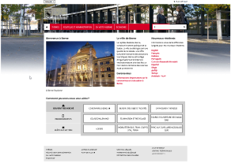

# Projet-BerneWebsite

## Recherche
---------
> ### Idée
> - Pays
> - Villes
----------
> ### Sujet
>- Inspiration
>- Images
>- Documentations
---------------------
## L'idée
>## La Suisse
>>- J'ai d'abord eu l'idée de la Suisse parce que ma fierté suisse me chuchoter à l'oreille.
>>>## Première idée : 
>>>>- ### Faire un site sur Geneve
>>>>> J'avais pensé à faire un site sur Genève, mais j'ai décidé de partir sur une autre ville un peu plus intéressante à mon goût.
>>>## Deuxième idée
>>>>- ### Faire un site sur Berne
>>>>> J'ai décidé de partir sur la ville de Berne car c'est la capitale (de facto) et donc ça m'interessait plus 
------------------------
## Le sujet
>## Berne
>>### Siteweb éxistant :
>>
---------------------