# Projet-BerneWebsite

## Recherche
---------
> ### Idée
> - Pays
> - Villes
----------
> ### Sujet
>- Inspiration
>- Images
>- Documentations
---------------------
> ### Création du site
>- Moodboard :
>>- Couleurs
>>- Polices
>>- Présentation en image
>- WireFrame :
>>- Footer
>- HighFidelity :
>>- Header
>>- Content
>>- Footer
>>- NewsLetter
>- Animations et transitions prévu :
>>- Hover
>>- Scrolling
>>- NewsLetter
----------
## L'idée
>## La Suisse
>>- J'ai d'abord eu l'idée de la Suisse parce que ma fierté suisse me chuchoter à l'oreille.
>>## Première idée : 
>>>- ### Faire un site sur Geneve
>>>> J'avais pensé à faire un site sur Genève, mais j'ai décidé de partir sur une autre ville un peu plus intéressante à mon goût.
>>## Deuxième idée
>>>- ### Faire un site sur Berne
>>>> J'ai décidé de partir sur la ville de Berne car c'est la capitale (de facto) et donc ça m'interessait plus 
------------------------
## Le sujet
>## Berne
>>### Siteweb éxistant :
>> 
>> ## Inspiration : 
>>> ### Mots clés :
>>>- Capitale
>>>- Produits locaux
>>>- Valorisation 
>>>- Unesco
>>> ## Images
>>>> ### Paysages :
>>>>  ======== 
>>>>  ======== 
>>>>  
>>>> ### Monuments :
>>>>  Palais fédéral ======== 
>>>>  Cathédrale 
---------------------
## Documentations
> ## Wikipedia [Berne wikipedia](https://fr.wikipedia.org/wiki/Berne)
>> ### Infos importante :
>>- Capitale de facto de la suisse
>>- Ville fédéral
>>- Germanophone
>>- Patrimoine culturel mondial de l'UNESCO
-------
## Création du site
> ## Moodboard
>> ### Couleurs :
>>>   
>>> **Pourquoi?** J'ai opté pour des couleurs simple pour que ce soit agréable a l'oeuil et valoriser l'aspect moderne
>> ### Polices :
>>>    
>>>Poppins
>> ### Présentation du moodboard : 
>>>   
> ## Wireframe
>> ### Header :
>>> 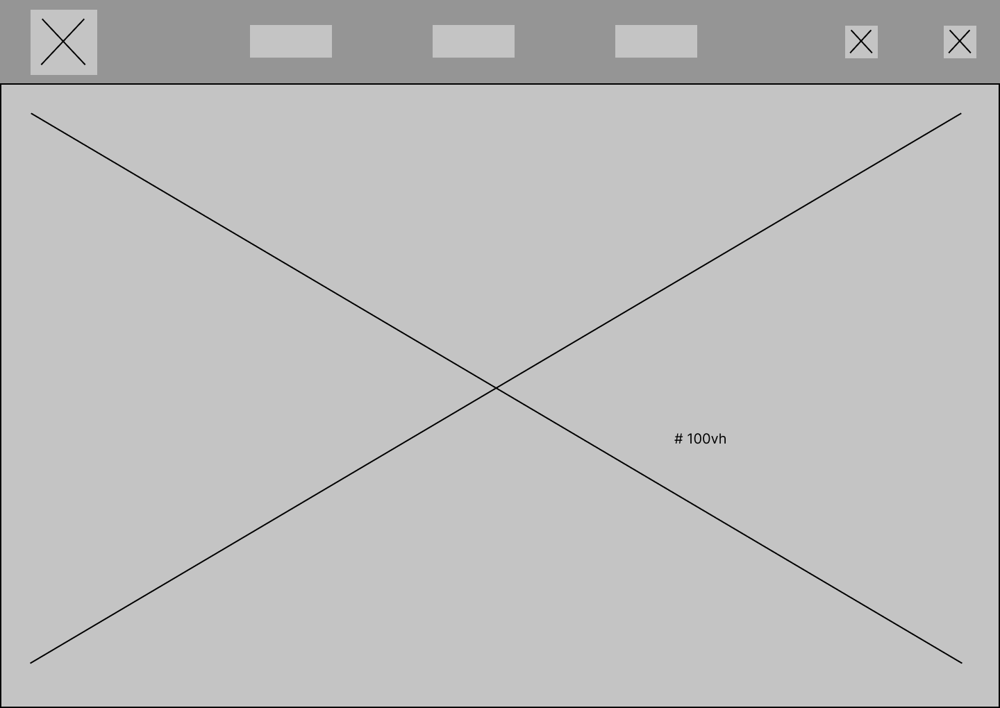
>> ### Content :
>>> 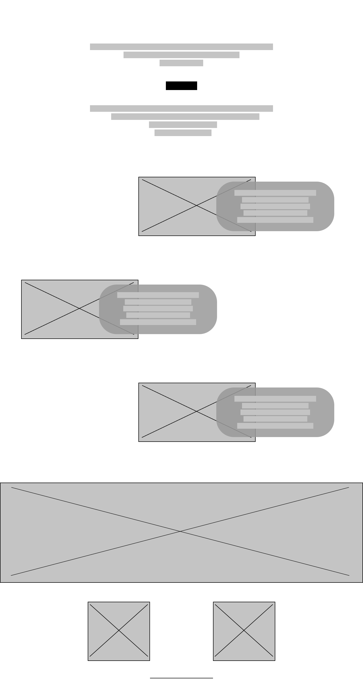
>> ### Footer :
>>> 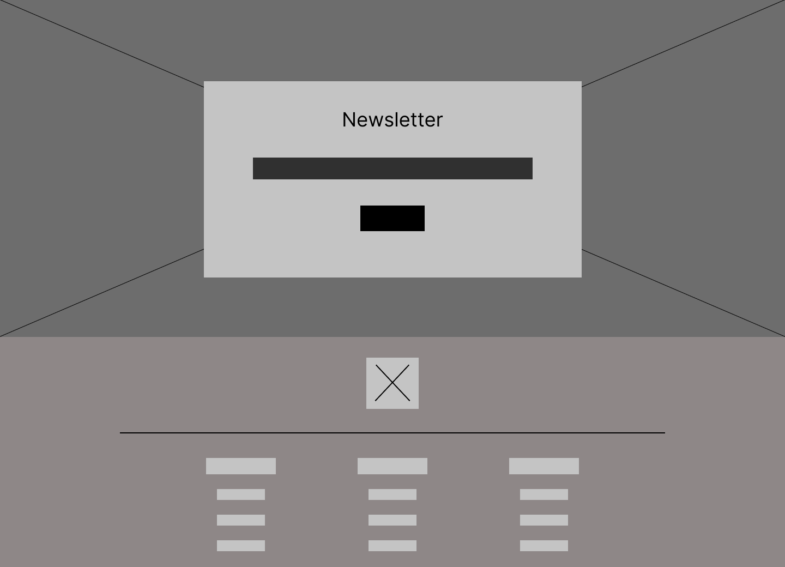
----
> ## HighFidelity
>> ### Header :
>>> 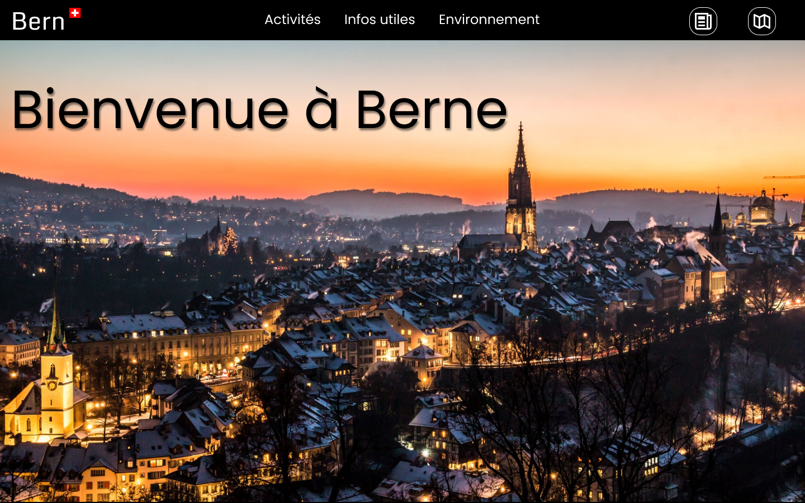
>> ### Content :
>>> 
>> ### Footer :
>>> 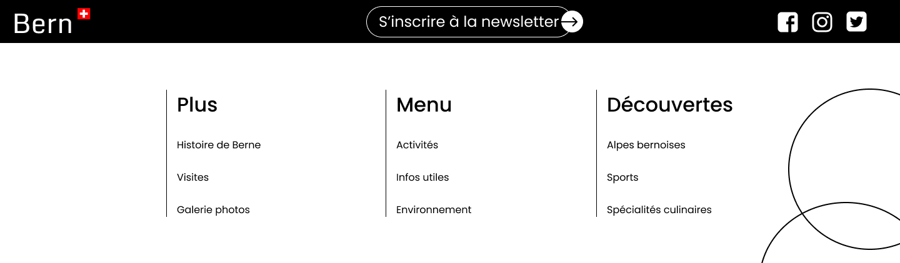
>> ### NewsLetter :
>>> 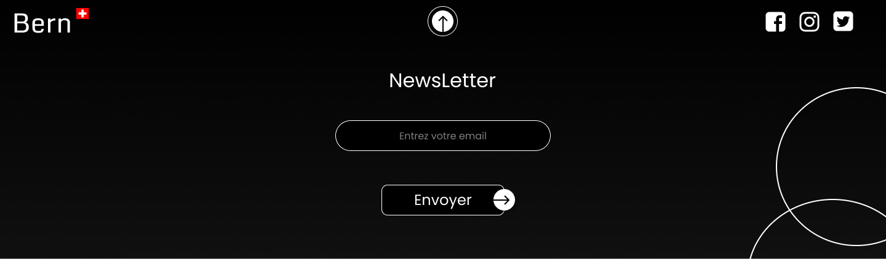
---
> ## Animations et transitions prévu
>> ### Hover :
>>> Liens du menu : 
>>> 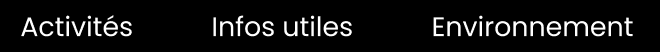 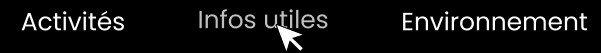
>>> Icones du menu : 
>>>  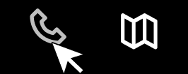
>>> Boutons "en savoir plus" : 
>>> 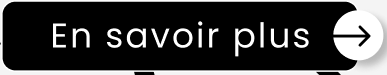 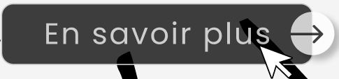
>>> Boutons "Découvrir" : 
>>> 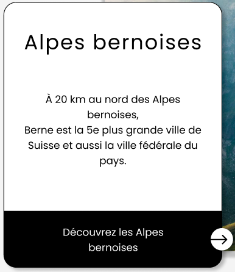 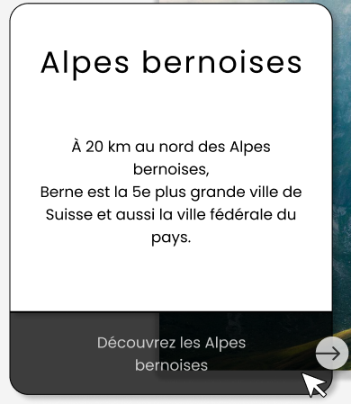
>>> Boutons NewsLetter : 
>>> 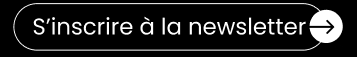 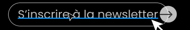
>>> Icones du footer : 
>>> 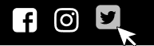
>>> Liens du menu : 
>>>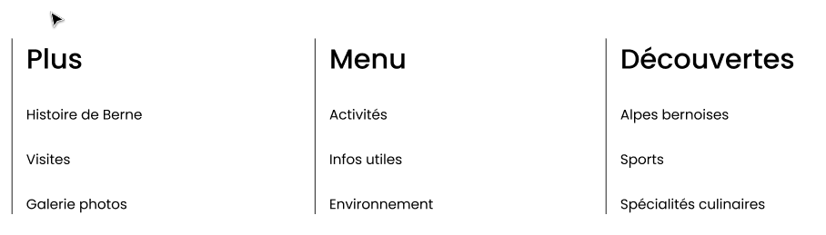 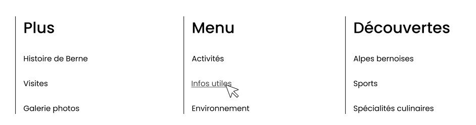
>>> Bouton NewsLetter ouvert : 
>>>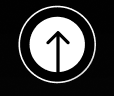 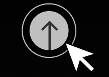
>>> Formulaire NewsLetter : 
>>>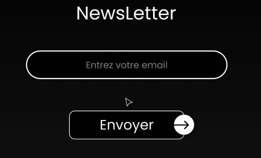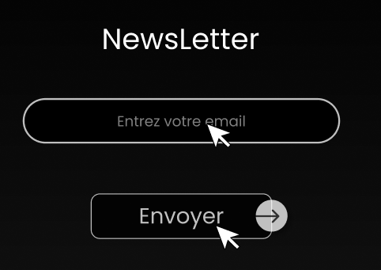
>> ### Scrolling
>>>Les images / bouton et peut être les textes ou seulement certains se dévoileront au fur et a mesure du scroll
>> ### NewsLetter :
>>> Une fois le bouton "NewsLetter" cliquez le bouton se transformera en fleche vers le haut avec une animation puis une transition fera doucement apparaitre le background noir puis le formulaire
---