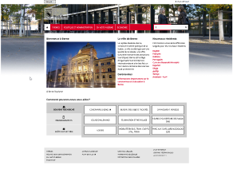
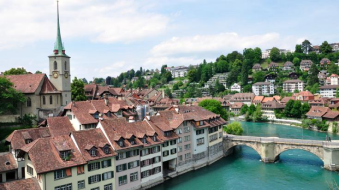
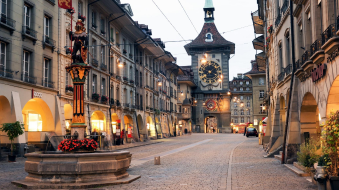
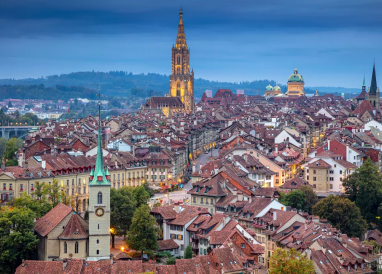
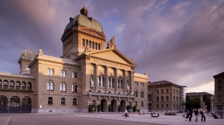
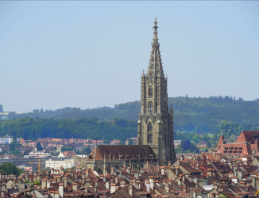
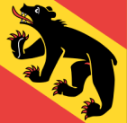
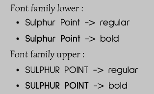
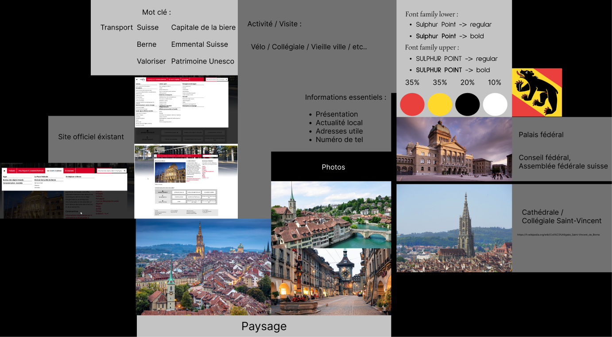

# Projet-BerneWebsite

## Recherche
---------
> ### Idée
> - Pays
> - Villes
----------
> ### Sujet
>- Inspiration
>- Images
>- Documentations
---------------------
> ### Création du site
>- Moodboard
>>- Couleurs
>>- Polices
>>- Présentation en image
----------
## L'idée
>## La Suisse
>>- J'ai d'abord eu l'idée de la Suisse parce que ma fierté suisse me chuchoter à l'oreille.
>>## Première idée : 
>>>- ### Faire un site sur Geneve
>>>> J'avais pensé à faire un site sur Genève, mais j'ai décidé de partir sur une autre ville un peu plus intéressante à mon goût.
>>## Deuxième idée
>>>- ### Faire un site sur Berne
>>>> J'ai décidé de partir sur la ville de Berne car c'est la capitale (de facto) et donc ça m'interessait plus 
------------------------
## Le sujet
>## Berne
>>### Siteweb éxistant :
>> 
>> ## Inspiration : 
>>> ### Mots clés :
>>>- Capitale
>>>- Produits locaux
>>>- Valorisation 
>>>- Unesco
>>> ## Images
>>>> ### Paysages :
>>>>  ======== 
>>>>  ======== 
>>>>  
>>>> ### Monuments :
>>>>  Palais fédéral ======== 
>>>>  Cathédrale 
---------------------
## Documentations
> ## Wikipedia [Berne wikipedia](https://fr.wikipedia.org/wiki/Berne)
>> ### Infos importante :
>>- Capitale de facto de la suisse
>>- Ville fédéral
>>- Germanophone
>>- Patrimoine culturel mondial de l'UNESCO
-------
## Création du site
> ## Moodboard
>> ### Couleurs :
>>>   

>>> **Pourquoi ces couleurs ? ...** Car ces couleurs font références au blason de berne et les pourcentages représente la quantitée qui sera utilisé sur le site final     
>> ### Polices :
>>>    
>>>Sulphur point
>> ### Présentation du moodboard : 
>>>   
----